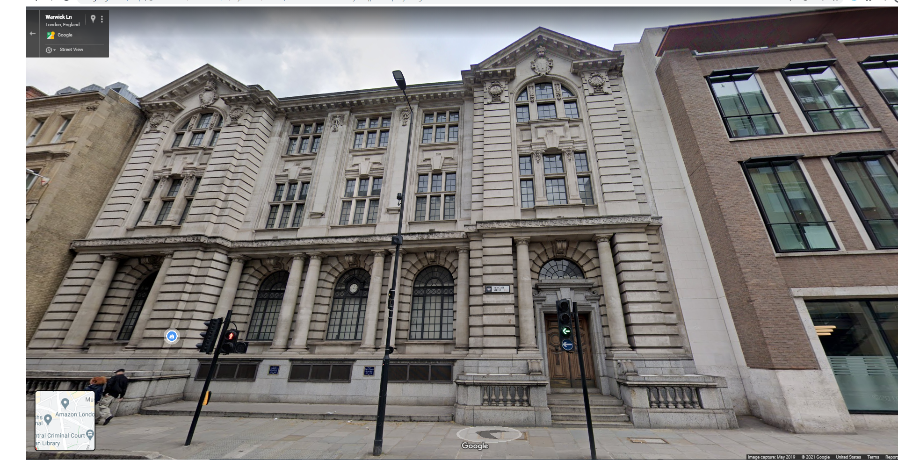
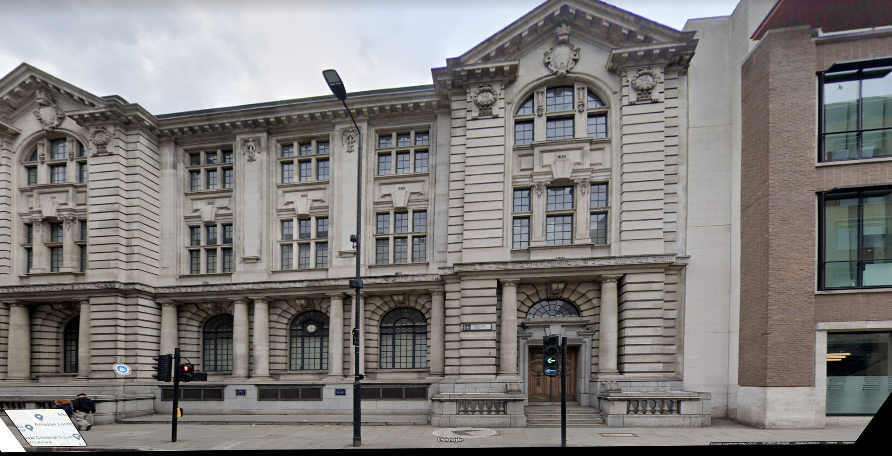
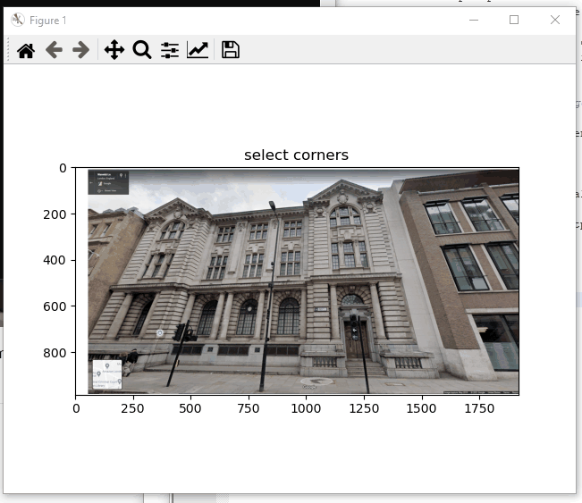
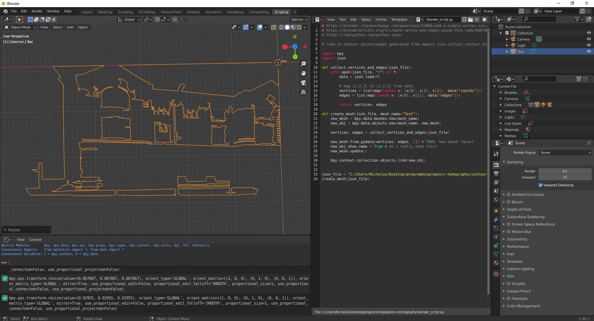

# homography    
learning about homography, contours and fixing skewed images with OpenCV and matplotlib, as well as some Blender scripting!    
    
## motivation:    
I was looking at some buildings in London via Google Maps for some inspiration for buildings to model in Blender and while looking at them from the perspective of the Google car camera thought it would awesome if I could take a snapshot of the buildings and somehow create some automation to construct at least the face of them in 3D.    
    
The first step in doing so I thought would be to correct the perspective of the building images taken from Google Maps. With this code, the perspective correction isn't perfect but it does seem to work as it should (see example below).    
    
     
    
This code allows a user to select 4 points that enclose the area of an image they wish to perform perspective correction on.    
    
## how to run:    
I recommend using miniconda. With miniconda installed you can run the following (assuming in the directory of this repo):    
```
> conda create --name homography opencv numpy matplotlib    
> conda activate homography    
> python homography.py    
```   
   
## example usage:    
    
    
## next steps:    
Now we can get a mostly perspective-corrected image. With this image, the next step would be to figure out how, if possible, to create a 3D representation of it in Blender (just the face of the building of course).    
    
I was able to create a script to transfer contour data (just vertices and edges) into Blender (see `blender_script.py` and `collect_contour_test.py`) but there's still a lot of things to be figured out and reworked (especially since getting the right contour data that you might need may take some trial and error with fiddling with some parameters). Here's an example though using the unwarped image:    
    
    
## acknowledgements:    
many thanks to Ashuta's great tutorial on homography: https://blog.ekbana.com/skew-correction-using-corner-detectors-and-homography-fda345e42e65    
    